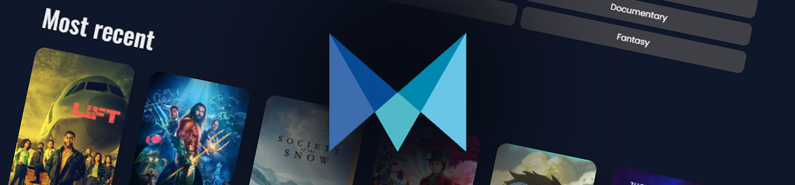

# Movie database

This is an assignment project in an in-depth JavaScript course. Generally speaking, I was tasked with creating a version of a movie database application that meets the requirements a user would expect when visiting a similar service. The solution is built with React, React Query, and Axios. As for the API, the application uses The Movie Database (TMDb) API (https://www.themoviedb.org/). The challenge here was to reuse my components as much as possible. For more information, please check out the "Documentation" section further down in this README file.

## The solution

Checkout the solution:

**⭐ Solution URL:** [https://mi-mbmovie.netlify.app/](https://mi-mbmovie.netlify.app/)

## Built with

- [React](https://reactjs.org/) - JS library
- [Vite](https://vitejs.dev/) - Frontend tooling
- [TMDb](https://wwwthemoviedb.org/) - API
- [Tanstack React Query](https://tanstack.com/query/v3/) - State management

## Screenshots

# Documentation

## Structure
Structure of the data flow in the application is as follows:

``App -> Pages -> Sections -> Components``

##  📁 Sections
### Description
The sections are responsible for setting the main layout of a specific section on the page and handle the fetch query depending on what properties it has. Then it will pass down the data to other components that displays the data accordingly.

Section name should reflect what kind of layout that is being used:

``<GridMovies>``
``<GridActors>``
``<MenuGenres>``
``<ListMovies>``
``<GridRecentVisited>``

### GridMovies
#### Description
GridMovies uses 4 properties:``url``  ``identifier`` ``option`` ``useRelated``

``url: string`` : Define the base-url 

``Identifier: string``: Can be an ID or something uniq to construct the endpoint.

``Option: string[]`` : (Optional) Is being used to construct endpoint

``useRelated: boolean`` : This is used for selecting between endpoints that are specific and endpoints with a general fetch request.

## 📦 Components
### Description
**Components CAN handle:**
* Its own _Interfaces_

### GridButtons
#### Description
GridButtons use 2 properties, ``id``  and ``title/name``.
This component is designed for genre buttons and contains a grid system that will display the buttons in a certain order.

### ImageAvatar
#### Description
ImageAvatar use 3 properties:
* ``data`` - Contains the dataset
* ``displayData`` - If text data as "name" and "character" should be displayed with the avatar.
* ``size`` - Size of the image in the avatar

### ListPagination
#### Description
ListPagination use 5 properties:
* ``page`` - Handles the what page is being clicked
* ``total_pages`` - How many pages the dataset contains
* ``id_param`` - specific id to construct reload url
* ``genre_param`` - Specific category
* ``type`` - Where is the pagination being used
* 
### OptionButtons
#### Description
OptionButtons is designed to be a generic component to be used in different scenarios.

ListPagination use 5 properties:
* ``handleClickOption`` - (data: string, localStorage: boolean) => void. Returns a function call
* ``data`` - What the button set will contain for information

## 📝 Interface
### Description
The folder Interface will contain all **GLOBAL** interfaces for the main data that is collected from the API.

``Actors``
``Genres``
``Movie``
``Movies``

## 🆎 Types
### Description
Types in this case imports all the interfaces to construct the types for the returning data from the API where the endpoint is similar. Example of this is ``movieActorType`` and ``allRelatedActorMovieType``.
